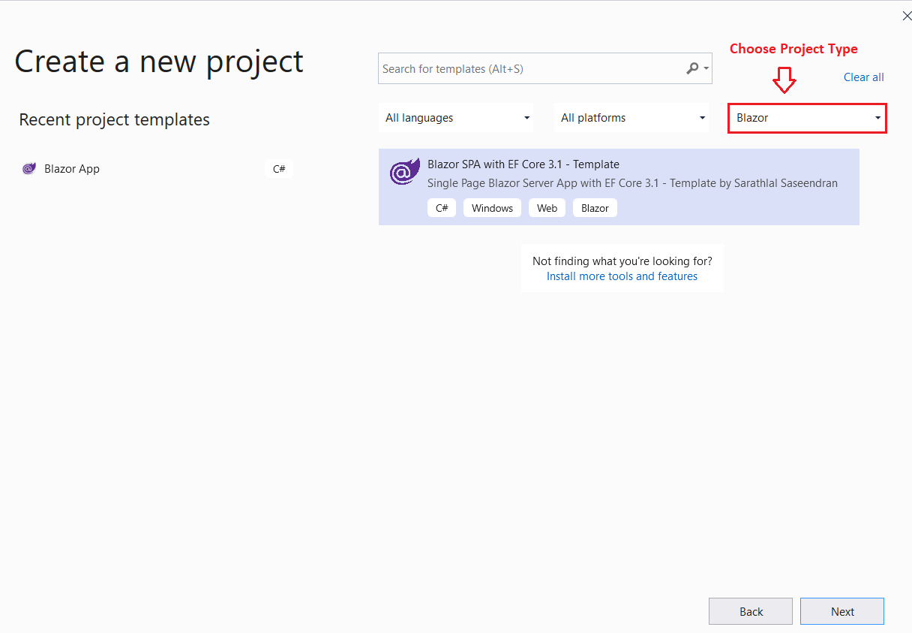
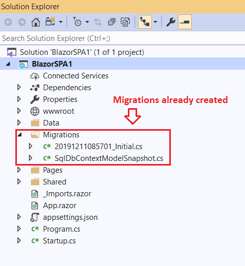
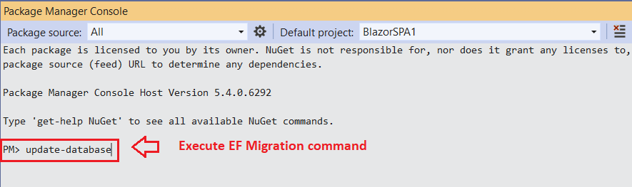
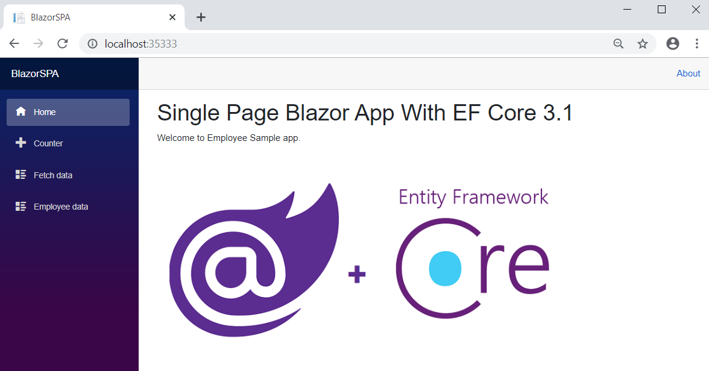

# Blazor SPA With EF Core 3.1 - Template

Repository for Blazor Server SPA with EF Core 3.1 Template
 
Download this extension from the [VS Marketplace](https://marketplace.visualstudio.com/items?itemName=SarathLal.blazorspawithefcore)

---------------------------------------
 
## Features
 
Create a Blazor Server SPA with EF Core 3.1 in a minute. 
You can create a simple Employee App with all CRUD actions
 
### Prerequisites
- Visual Studio 2019 v 16.4 or higher
  

### Steps to install the Template in your Machine

#### Step 1: Choose our Blazor template from Visual Studio, after successfull installation of the extension

#### Step 2: Choose a valid path and name to your project

#### Step 3: Verify the migration folder is already generated. 

#### Step 4: Execute EF Migration command to create database locally. You can change the server details, if needed. 

#### Step 5: Thats all!! Run the application 

#### Step 6: Create a new Employee record

#### You can try to edit/delete the employee record as well.

## License
[Apache 2.0](LICENSE)

